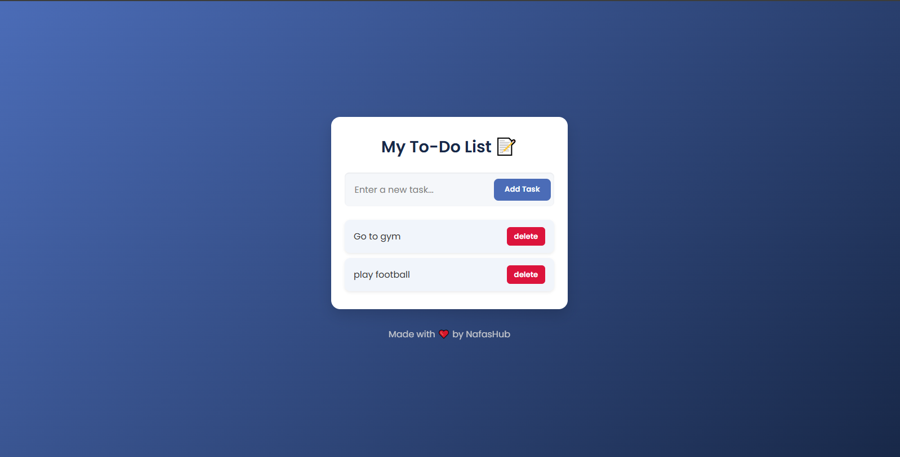

# 📝 To-Do List App

A lightweight and responsive **To-Do List Web App** built with **HTML, CSS, and JavaScript**.  
It’s designed to help users stay organized by managing their daily activities efficiently — add, edit, complete, and delete tasks with ease.  
Simple, elegant, and beginner-friendly.

---

## 🚀 Features

- ➕ Add new tasks  
- ✏️ Edit existing tasks  
- ✅ Mark tasks as completed  
- 🗑️ Delete tasks  
- 💾 Auto-saves tasks using local storage (data persists after reload)  
- 📱 Fully responsive and mobile-friendly design  

---

## 🧠 Technologies Used

- **HTML5** – Structure and layout  
- **CSS3** – Styling and responsiveness  
- **JavaScript (ES6)** – Functionality and interactivity  

---

## 📸 Preview
Here’s a preview of the app interface:


---

## 👨‍💻 Author
NafasHub (Faaiz1505)
Creative Web Developer passionate about building user-friendly, functional web applications.

💼 GitHub: @Faaiz1505

✉️ Email: nafashub755@gmail.com

🌍 Portfolio: https://your-portfolio-link.com

## 🪪 License
This project is open source and available under the MIT License

## ⚙️ Installation & Setup

Follow these steps to run the app locally:

1. **Clone this repository**
   ```bash
   git clone https://github.com/Faaiz1505/to-do_List_App.git
   
2. **Navigate into the project folder**
  ```bash
  cd to-do_List_App

---

## Then launch with Live Server for the best experience.

🌐 Live Demo
🔗 View Demo
